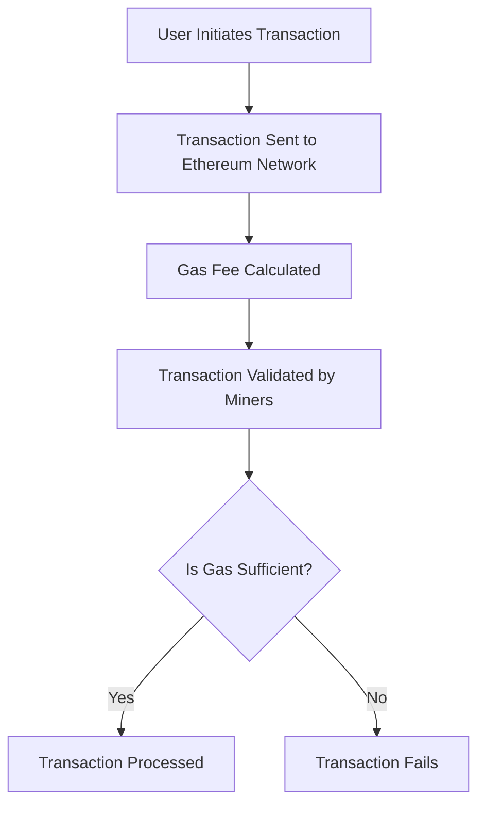

# Gas in Ethereum

"Gas" is required to complete every transaction.

**Gas**: a unit that measures the "computational effort" needed to perform operations on Ethereum. The more complicated the code, the more gas is needed.

### Gas units
To understand how gas is used, we first need to look at the different "units" Ethereum defines to represent gas:

| Unit      | Value in Wei                           | Description                       |
| --------- | -------------------------------------- | --------------------------------- |
| **wei**   | `1`                                    | Smallest unit of ETH              |
| **gwei**  | `1,000,000,000` wei (10⁹)              | Common unit for **gas price**     |
| **ether** | `1,000,000,000,000,000,000` wei (10¹⁸) | Main unit, what people call “ETH” |

### How do we know how much gas we need to use for a transaction?

**Gas Estimation**: is the process of predicting how much gas a transaction will use before executing it. This helps prevent setting gas limits too low (which would fail the transaction) or too high (which might overpay the transaction fees).

| Element       | Role                          | Who Sets It           | Example Value               |
| ------------- | ----------------------------- | --------------------- | --------------------------- |
| **Gas Used**  | Measures work done            | Determined by the EVM | 21,000 for ETH transfer     |
| **Gas Limit** | Max gas you're willing to use | You (or your wallet)  | Usually just above estimate |
| **Gas Price** | Price per gas unit            | You (or your wallet)  | 50 gwei = 50 × 10⁹ wei      |

**Example**: 
You want to send 1 ETH to a friend

**Gas Used** = 21,000 wei (EVM defined; ETH transfer)

**Max gas you are willing to pay** = 22,000 (set by you, just above the "gas used")

**Gas Price** = 50 gwei (determined by how busy the network is) 

Now we need to calculate the amount of ETH needed for the transaction. (gas used * gas price = ETH needed)

**Convert gwei to wei: (multiply by 10^9)**

21000 wei * 50,000,000,000 wei = 1,050,000,000,000,000 wei

Convert Wei to ETH (divide by 10^18)

1,050,000,000,000,000 wei / 10^18 = 0.00105 ETH

